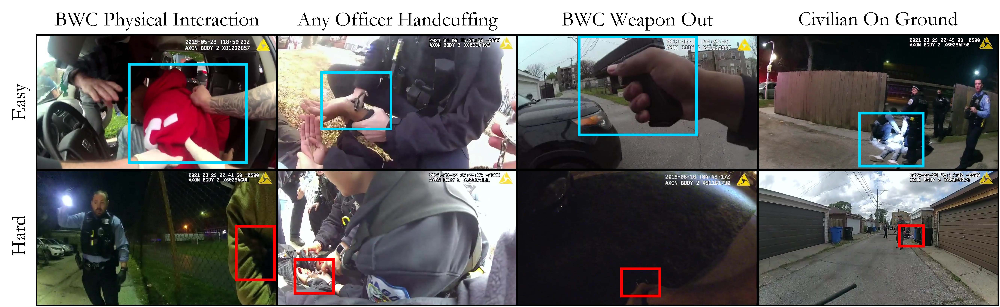

# EgoPolice: A Benchmark for Egocentric Video Understanding in High-Stakes Police Body-Worn Camera Footage

<!-- [](https://arxiv.org/abs/2501.01426) -->
[](https://docs.google.com/forms/d/e/1FAIpQLSfrYjORygCuY-I4T7zzmB-W2dEkStsOH0IrdV0PXqFh-ie8iA/viewform)



EgoPolice is a benchmark dataset of over 180 hours of real, egocentric police–civilian interactions sourced from publicly available body-worn camera footage across multiple U.S. police departments. The dataset provides second-by-second annotations across nine action classes and supports both supervised learning and zero-shot evaluation of video-language models. It serves as a benchmark for evaluating video understanding methods on real-world police–civilian interactions.

## Action Labels

| Role | Action | Definition |
|------|--------|------------|
| BWC Wearer | Physical Interaction | • The Body-Camera Wearer is touching the civilian. |
| BWC Wearer | Medical Treatment | • BWC Wearer is touching the civilian with hands.<br>• Both civilian and BWC Wearer's actions are visible.<br>• BWC Wearer is directly involved in treatment. |
| BWC Wearer | Weapon Out | • The clip displays a firearm held by the BWC Wearer. |
| BWC Wearer | Running | • The camera is moving/shaking substantially.<br>• The officer is moving forwards or backwards quickly. |
| Other Officer | Physical Interaction | • An officer (not the BWC wearer) is touching the civilian. |
| Other Officer | Medical Treatment | • An officer (not the BWC wearer) is touching the civilian with hands.<br>• Both civilian and police are visible.<br>• The officer is directly involved in treatment. |
| Any Police Officer | Handcuffing | • Any officer is attempting to use or using handcuffs.<br>• Handcuffs are clearly identifiable. |
| Civilian | Visibly Injured | • The civilian is visibly injured.<br>• The clip shows bleeding or a wound. |
| Civilian | On Ground | • The civilian is sitting, kneeling, or lying on the ground.<br>• Ground position is clear from the video. |

## Data Format

### videos.txt
This file contains list of all the videos that needs to be downloaded.  
File format is as follows: 
`video_id, video URL, start second, end second`  
If we are using the entire video without clipping, start/end second is -1. 

This file contains list of all the videos that needs to be downloaded.
File format is as follows:
`video_id, video source, start second, end second`
If we are getting full video without clipping, start/end second is -1.

E.g.,

```
video-1, https://www.youtube.com/watch?v=dQw4w9WgXcQ, 10, 20
video-2, https://www.youtube.com/watch?v=dQw4w9WgXcQ, -1, -1
...
video-10, https://vimeo.com/714785167, 10, 20
video-11, https://vimeo.com/714785167, -1, -1
```

### classification.json

Second-by-second action labels for each video clip. Top-level keys:

- **`labels`**: maps `video_id` to 9 binary vectors (one per action class), each of length = clip duration in seconds. Class indices are defined in `idx_to_class_name`.
- **`idx_to_class_name`**: maps class index (0–8) to action name (e.g. `bwc_physical_inter`, `handcuffing`, `c_on_ground`).
- **`training_folds`**: list of 6 cross-validation folds where each fold splits video IDs into `train`, `val`, `id-test`, `ood-l (pasadena)`, and `ood-t (copa)`. See paper for more information on the individual splits.
- **`metadata`**: brief description of the file format.


```python
# Example usage
video_id = 'video-1'
idx2cls = data["idx_to_class_name"] # {"0": "bwc_medical_treat", 
                                    #  "1": "bwc_physical_inter", 
                                    #  "2": "bwc_running", 
                                    #  ...
                                    #  "7": "other_medical_treat", 
                                    #  "8": "other_physical_inter"}

video_labels = data["labels"][video_id]  # [
                                         #   [1, 0, 0, 0, 0, 0, 0, 1, 0],
                                         #   ...
                                         #   [1, 0, 0, 0, 0, 0, 0, 1, 0],
                                         # ]

# Which actions are active at second 0?
second = 0
active = [
            idx2cls[str(i)]
            for i, labels in enumerate(video_labels)
            if labels[second] == 1
         ]  # ['bwc_medical_treat', 'other_medical_treat']
```

### mcq_*s.json
This file contains questions for MCQ benchmark.
E.g., 
```json
[
    {
        "id": {question_id},            # unique ID
        "video": {video_id},
        "start second": 210,            # inclusive
        "end second": 211,              # exclusive, i.e., [210, 211)
        "question": "Which action is happening in this video clip?",
        "options": [
            "A civilian displays visible wounds or is bleeding.",
            "The officer wearing the camera is running.",
            "A firearm, a taser, a gun or a rifle of the officer wearing the camera is visible in the video.",
            "The officer wearing the camera is providing visible medical assistance.",
            "None of the above"
        ],
        "answer": 3                     # from [0,1,2,3,4]
    },
    ...
]
```

## Request Access

Researchers interested in accessing the EgoPolice dataset should submit a request through the following link: [Link](https://docs.google.com/forms/d/e/1FAIpQLSfrYjORygCuY-I4T7zzmB-W2dEkStsOH0IrdV0PXqFh-ie8iA/viewform). Once your request has been approved, we will provide you instructions to the download the dataset.


## Annotation Tool

To ensure efficient and correct annotations we built a custom annotation tool. Please see [annotation tool](annotation_tool/README.md) for more information.

## Citation

If you find our work useful, please cite our paper.

```
@inproceedings{egopolice,
      title={EgoPolice: A Benchmark for Egocentric Video Understanding in High-Stakes Police Body-Worn Camera Footage},
      author={Gonzalez Saez-Diez, Max and Chung, Jihoon and Wolsky, Adam D. and Lanzalotto, Greg and Knox, Dean and Mummolo, Jonathan and Stewart, Brandon M. and Russakovsky, Olga},
      booktitle = {European Conference on Computer Vision (ECCV)},
      year={2026},
}
```
