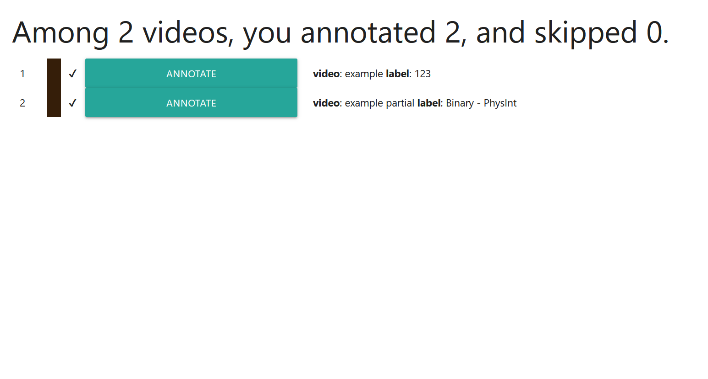
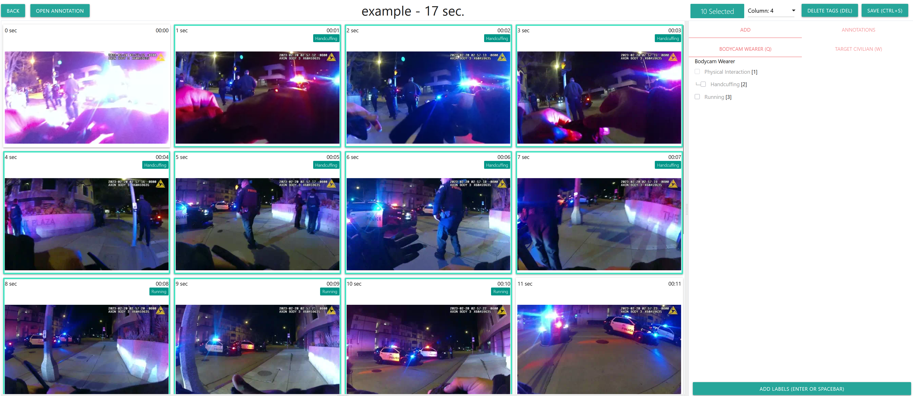

# Annotation

## Assignments



All the assigned videos show up on the page when annotators log in. Labeling is saved in the browser cookie, so the tool knows which videos are annotated or not. 

## Labeling



All the annotation can be done with keyboard shortcuts. Press either `q` or `w` to select the entity, `1` to `9` to select the action and press `spacebar` to label. To delete, the annotator can drag the frames, and press `del`. 

To save, the annotator can press `ctrl+s`.  

## Saved Annotation File

Annotation files are saved as JSON.

```json
{
  "user_video.index": "2",
  "video.name": "example",
  "video.original_name": "example",
  "video.start_time": 0,
  "video.end_time": 16,
  "user.id": "annotator2",
  "label.names": [
    "Bodycam Wearer/Physical Interaction",
    "Bodycam Wearer/Handcuffing",
    "Bodycam Wearer/Running",
    "Target Civilian/Compliant"
  ],
  "annotations": {
    "1": [
      0,
      1,
      0,
      0
    ],
    ...
    "10": [
      0,
      0,
      1,
      0
    ]
  }
}
```

For example, `data['annotations'][1]` shows annotation of `1-sec`. Unannotated seconds are omitted in the file. Saved files are not uploaded to the server in any way, so the annotator must send the file to the admin directly. 