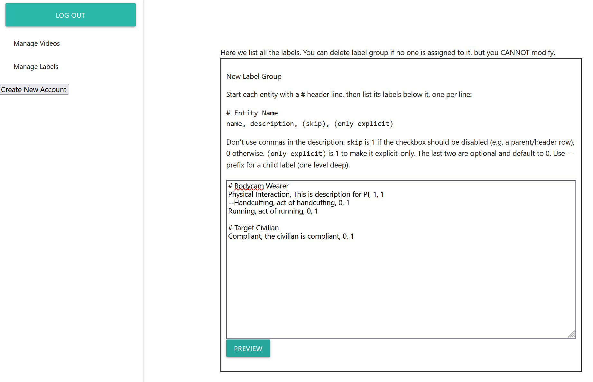
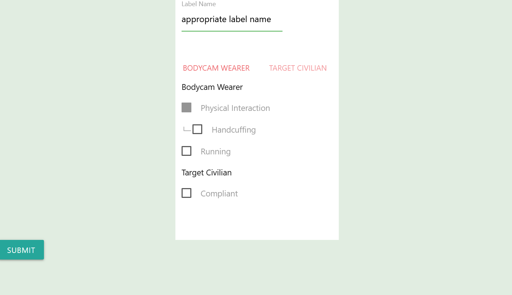
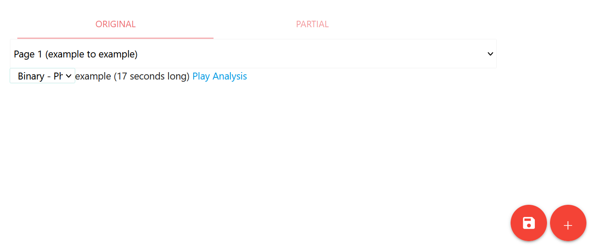
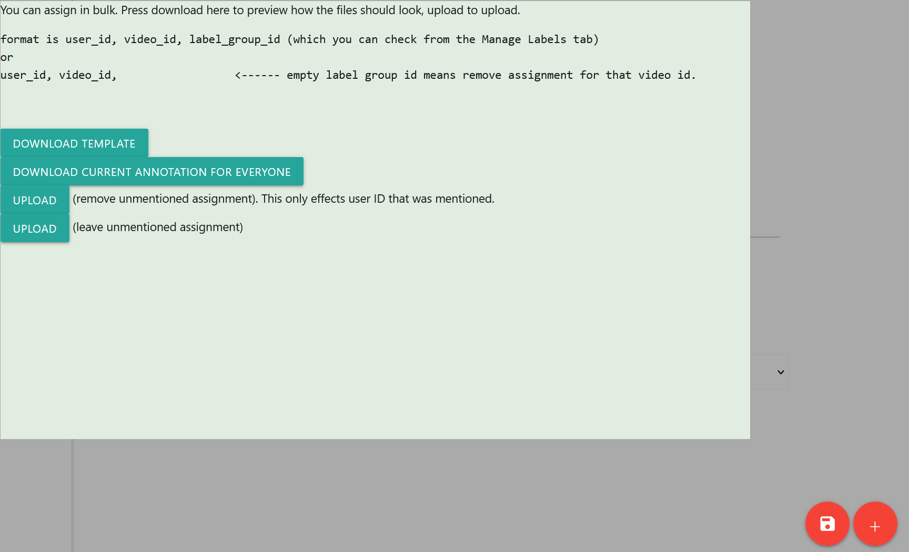

# Get Started / Demo

## Add Video File

Add your videos to `./video`, split them into 1-second webps, and put them in `./webp/example`. 
To split the videos, you can refer to the demo code below. 
```python
import os
import glob
video_file = 'example' # omit '.mp4'

# get 30-fps frames from the video file
cmd = f"ffmpeg -i {video_file}.mp4 -vf fps=30 -qscale:v 2 ./frames/{video_file}/%05d.jpg"
os.system(cmd)

frame_cnt = len(glob.glob('./frames/{video_file}/*.jpg'))

step = 0
for i in range(0, frame_cnt, 30):
    step += 1
    target = f"./webps/{video_file}"
    os.makedirs(target, exist_ok=True)
    cmd = f"ffmpeg -r 30 -start_number {i} -i ./frames/{video_file}/%05d.jpg -vframes 30 -pix_fmt yuv420p -filter:v scale=480:-1 ./webps/{video_file}/{step:05d}.webpr"
    os.system(cmd)
```

We've provided a demo video and demo webps to start with. 

## Add Video to the Database

### Original Video
Once the video file is generated, you have to add the video to the database. This can only be done directly with MySQL.

```sql
INSERT INTO `video`
  (`name`, `description`, `webp_location`, `mp4_location`,
   `second`, `original`, `start_time`, `end_time`, `original_index`)
VALUES
  ('example', 'Demo clip', 'webp/example', './video/example.mp4',
   17, 1, 0, 16, 0);
```

### Partial Video
There are cases where the video is 1-hour long, and you only want to supply the annotators with a sub-clip from 10:00 to 12:00. We call these _Partial Videos_, and they are labeled with `original==0` in the database.   
This can be done through either SQL commands or the web interface. 

```sql
INSERT INTO `video`
  (`name`, `description`, `webp_location`, `mp4_location`,
   `second`, `original`, `start_time`, `end_time`, `original_index`)
VALUES
  ('example partial', 'Demo clip partial', 'webp/example', './video/example.mp4',
   10, 0, 3, 12, 1);
```

## Add Action Labels
Paste the following text in Manage Labels
```
# Bodycam Wearer
Physical Interaction, This is description for PI, 1, 1
--Handcuffing, act of handcuffing, 0, 1
Running, act of running, 0, 1

# Target Civilian
Compliant, the civilian is compliant, 0, 1
```


Write an appropriate label group name before submitting


Additionally, let's add a binary classification label

```
# Bodycam Wearer
Physical Interaction, This is description for PI, 0, 1
```
and set label group name to be `Binary - PhyInt`

## Create Annotator Account

Click "Create New Account" on the Manage Page. A password is not set initially. The account has to be made by the admin, and the admin has to give the password to the user. 

## Assigning Videos

Assignment can be done in the web interface. You can either manually select each video, or upload a text file for bulk update. Unfortunately, the tool cannot assign the same video to the same annotator twice, even if the label group is different. 

**Manual Assignment**

You can select the label group from the drop-down menu, and click the save icon.


**Bulk Assignment**



If there are a lot of annotators, and you want to assign hundreds of videos at once, you can use bulk assignment by clicking the red plus button. 

Bulk uploading is done by uploading a text file.
```
annotator2, example, 1
```

> Note that label_group_id is an auto-assigned integer (`label_group.group_index`), not the group name you typed. (Not `Binary-PhyInt`)

If you want to only Add/Modify assignments without affecting previous assignment, use the second upload button. If you want to remove all the assignments of mentioned users and then add assignments, use the first Upload button. 

## Annotating

To annotate, you need to log out, and log in to the annotator account you've just made. See [annotation](ANNOTATION.md) for annotation tool usage.